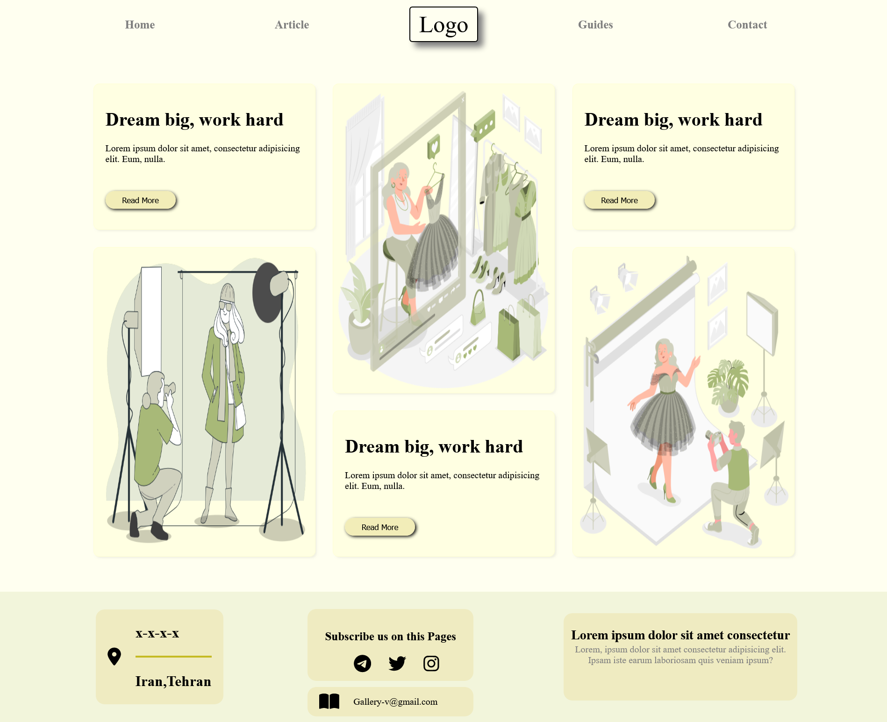

# 📸 Gallery-V

Gallery-V یک قالب گالری تصاویر مدرن و واکنش‌گرا (Responsive) است که با استفاده از HTML5 و CSS3 طراحی شده است. این پروژه با تمرکز بر نمایش تصاویر، طراحی مینیمال و تجربه کاربری روان توسعه داده شده و می‌تواند به عنوان نمونه‌کار فرانت‌اند یا پایه‌ای برای وب‌سایت‌های عکاسی، مد، نمونه‌کار شخصی و گالری‌های آنلاین مورد استفاده قرار گیرد.

## ✨ ویژگی‌های پروژه

* طراحی کاملاً واکنش‌گرا (Responsive)
* پیاده‌سازی با HTML5 و CSS3 خالص
* استفاده از CSS Grid Layout
* گالری تصاویر مدرن با چیدمان پویا
* منوی ناوبری دسکتاپ و موبایل
* منوی موبایل بدون JavaScript
* طراحی مینیمال و سبک
* بخش معرفی محتوا (Hero Content)
* فوتر حرفه‌ای با اطلاعات تماس
* لینک شبکه‌های اجتماعی
* افکت‌های بصری و سایه‌های مدرن
* ساختار ساده و قابل توسعه

## 🛠️ تکنولوژی‌های استفاده شده

* HTML5
* CSS3
* CSS Grid
* Flexbox
* Font Awesome Icons

## 📂 بخش‌های پروژه

### Header

* منوی ناوبری
* لوگوی مرکزی
* نسخه اختصاصی موبایل

### Gallery Section

* نمایش تصاویر در قالب Grid
* کارت‌های متنی در کنار تصاویر
* طراحی مناسب برای محتوای تصویری

### Responsive Mobile Menu

* پیاده‌سازی با Checkbox Hack
* بدون نیاز به JavaScript
* تجربه کاربری روان در دستگاه‌های کوچک

### Footer

* اطلاعات تماس
* موقعیت مکانی
* ایمیل
* شبکه‌های اجتماعی
* توضیحات پروژه

## 🎨 ویژگی‌های طراحی

* استفاده از CSS Grid برای چیدمان حرفه‌ای
* طراحی مینیمال و مدرن
* رنگ‌بندی ملایم و کاربرپسند
* کارت‌های دارای سایه و گوشه‌های گرد
* ساختار مناسب برای گالری‌های تصویری
* بهینه‌سازی شده برای موبایل و دسکتاپ

## 📱 قابلیت ریسپانسیو

پروژه برای نمایش صحیح در دستگاه‌های مختلف طراحی شده است:

* Desktop
* Laptop
* Tablet
* Mobile

در نسخه موبایل:

* منوی ناوبری به منوی موبایل تبدیل می‌شود.
* گالری تصاویر به صورت تک ستونه نمایش داده می‌شود.
* فوتر برای نمایش بهتر بازچینی می‌شود
  
* 
## پیش نمایش 


## 🚀 نحوه اجرا

```bash
git clone https://github.com/Aref18/Gallery-V.git
```

سپس فایل `index.html` را در مرورگر اجرا کنید.

## 🎯 هدف پروژه

هدف این پروژه تمرین طراحی رابط کاربری مدرن، کار با CSS Grid، پیاده‌سازی طراحی واکنش‌گرا و ساخت یک گالری تصاویر حرفه‌ای بدون استفاده از فریمورک‌های جانبی بوده است.

## 📚 مفاهیم تمرین‌شده

* CSS Grid
* Flexbox
* Responsive Design
* Mobile First Concepts
* CSS Transitions
* Layout Design
* Semantic HTML

---

Developed with ❤️ by Aref
